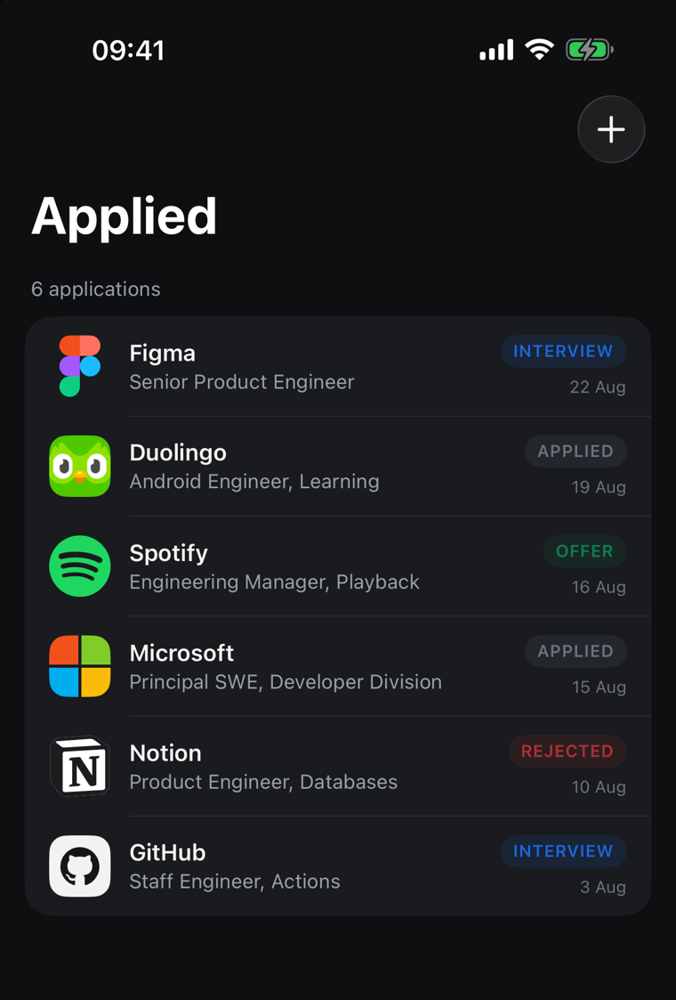
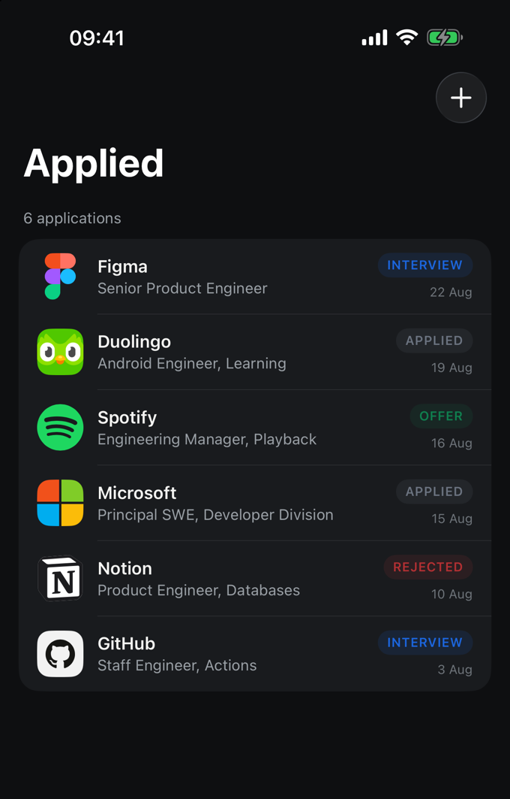
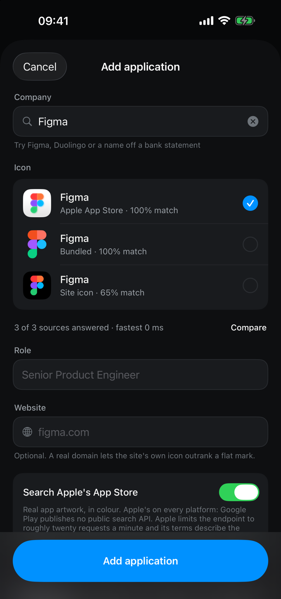

# BrandIcons

[](https://github.com/infiniah/brand-icons-ios/actions/workflows/ci.yml)
[](https://swift.org)
[](https://swift.org)
[](https://swift.org/package-manager/)
[](LICENSE)

**Brand icons, instantly, with no network call.**

Fetching a company logo normally means someone else's API: a round trip you wait on, a key to
keep, a bill that grows with your users, a rate limit, an outage you cannot fix, and a third party
who now knows every company your users look at.

This is a local lookup. **4,309 brands are compiled in**, so an icon costs about **10 microseconds**
and cannot fail, throttle, or phone anyone. It works offline.

<p align="center">
  
  
  
</p>

## Why not just…

**…call a logo API?** Latency on every icon, a key to manage, a bill per lookup, a rate limit, and
an outage you cannot fix. This is a function call against memory.

**…ship an icon set and look these up yourself?** An icon set gives you files, keyed by exact slug.
It does not answer "which brand is `APPLE.COM/BILL SPOTIFY`". You would end up writing the
normaliser, the scorer and the tie-breaking, which is what this is.

**…use the App Store search?** You can, and this wraps it as an optional tier for the cases a
monochrome catalogue cannot serve. But it is rate limited to about twenty requests a minute, it
needs a network, and Apple's terms describe that artwork as promotional material for store content.
It is off by default for those reasons.

**…just take the top match?** That is how you silently draw the wrong logo. `Amazon` matches two
Amazon sub brands at exactly the same score, and the honest answer is to ask.

## What you get

- **4,309 marks compiled in**, 3,175 of them in full colour. No network, no key, no rate limit.
- **A score you can act on**, built from token overlap and structure rather than one fuzzy distance.
- **`isAmbiguous()`**, so a coin-flip becomes a chooser instead of a wrong icon.
- **Optional network tiers**: Apple's App Store, and the site's own favicon.
- About 10 µs for a name the catalogue knows, once it is loaded.
- Swift 6, strict concurrency, zero dependencies.

## Install

```swift
.package(url: "https://github.com/infiniah/brand-icons-ios", from: "1.0.0")
```

## Use

```swift
import BrandIcons

let resolver = BrandIconResolver()

for application in applications {
    let query = BrandQuery(name: application.company, domain: application.domain)
    application.icon = await resolver.resolve(query).best()
}
```

`BrandIconResolver` is an actor and caches per query, so calling it once per row of a list is fine.

To draw the answer:

```swift
BrandIconView(candidate: icon, fallbackText: application.company, size: 40)
```

When `candidate` is nil it draws a monogram, so a list never develops holes while lookups are in
flight.

## What it costs your app

The catalogue is the whole point and the whole weight: it is vector geometry for 4,309 brands, and
nothing else in the package is measurable beside it.

| | brands | in your bundle |
| --- | --- | --- |
| full | 4,309 | **2.44 MB** |
| compact | 4,087 | **1.65 MB** |

Those are the compressed sizes, which is what an app store actually ships.

The compact catalogue leaves out 222 marks whose path data runs past 4 KB. Those are
illustrations rather than icons, detailed enough to be mush at 40 points, and they are what makes
the difference. Everything else is identical, including every score.

## It takes the names you actually have

The lookup is a resolver, not a filename match, so a string that came off a bank statement or a
user's typing still finds the brand:

```
"APPLE.COM/BILL SPOTIFY"   →   Spotify      1.00
"NOTION LABS INC"          →   Notion       0.81
"SQ *BLUE BOTTLE"          →   nothing      —
"Amazon"                   →   two sub brands tie, ask the user
```

## Acting on the score

Pick a threshold from what a wrong answer costs you.

```swift
let result = await resolver.resolve("Amazon")

if let best = result.best(minimum: 0.8) {
    draw(best)                        // confident enough to write down
} else if result.isAmbiguous() {
    askTheUser(result.candidates)     // two Amazon sub brands tie exactly
}
```

| Score | Meaning |
| --- | --- |
| 1.00 | the normalised names are identical |
| 0.72 – 0.90 | the query is the brand plus extra words, like a statement descriptor |
| 0.42 – 0.60 | the brand is more specific than the query. `Apple` is not `Apple TV` |
| below 0.35 | discarded rather than returned |

## Offline by default

The bundled catalogue answers first and the resolver stops as soon as a candidate is good enough,
so a name it knows never opens a socket. To guarantee it:

```swift
let resolver = BrandIconResolver(configuration: .offline)
```

## Other platforms

The same library, scored against the same fixtures so all of them agree on what a name means.

| Platform | Repository |
| --- | --- |
| iOS and macOS, Swift | this repository |
| Android, Kotlin | [infiniah/brand-icons-android](https://github.com/infiniah/brand-icons-android) |
| Flutter, Dart | [infiniah/brand-icons-flutter](https://github.com/infiniah/brand-icons-flutter) |
| React Native and Expo, TypeScript | [infiniah/brand-icons-expo](https://github.com/infiniah/brand-icons-expo) |

## Documentation

| | |
| --- | --- |
| [Provider tiers](docs/providers.md) | what each source costs, and when a bundled mark is the wrong picture |
| [Configuration](docs/configuration.md) | every option, and ranking by preferred source |
| [How matching works](docs/matching.md) | the scoring bands, lookup cost, and measuring against your own names |
| [Licensing the marks](docs/licensing.md) | CC0, MIT, trademark, and the restrictive handful |

## Example app

`Examples/Applied` is a job application tracker that resolves an icon for every company and shows
what each tier returned, ranked, with the time each took. Open `Applied.xcodeproj` and run.

## Contributing

Issues and pull requests welcome. Run `swift test` before opening one.

## License

MIT for the code. The marks carry their own terms, see [docs/licensing.md](docs/licensing.md)
and [NOTICE](NOTICE).
