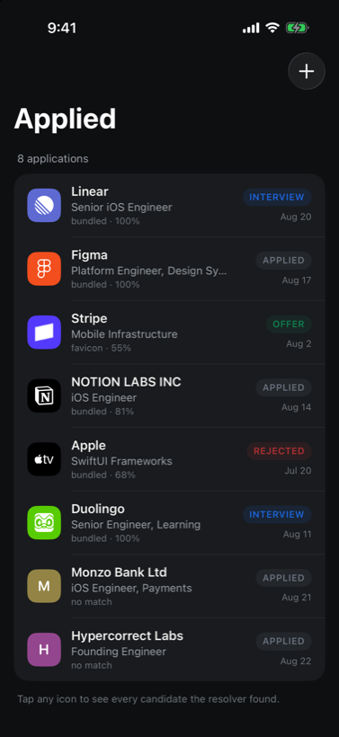

# BrandIcons

[](https://github.com/infiniah/brand-icons-ios/actions/workflows/ci.yml)
[](https://swift.org)
[](https://swift.org)
[](https://swift.org/package-manager/)
[](LICENSE)

Resolve a messy service name into ranked brand icon candidates, with a confidence score you can act on.

```swift
let resolver = BrandIconResolver()
let result = await resolver.resolve("NETFLIX.COM")
let icon = result.best(minimum: 0.8)
```

* [Why](#why)
* [Requirements](#requirements)
* [Installation](#installation)
* [Usage](#usage)
* [Confidence and ambiguity](#confidence-and-ambiguity)
* [Provider tiers](#provider-tiers)
* [Running offline](#running-offline)
* [Configuration](#configuration)
* [Restrictively licensed marks](#restrictively-licensed-marks)
* [Measuring the tiers against your own names](#measuring-the-tiers-against-your-own-names)
* [How the matching works](#how-the-matching-works)
* [Lookup cost](#lookup-cost)
* [Example app](#example-app)
* [Documentation](#documentation)
* [Contributing](#contributing)
* [Licensing the marks](#licensing-the-marks)
* [License](#license)

## Why

`icon` above is a `BrandIconCandidate?`, and the optional is the point. The honest answer to
"which brand is `SQ *BLUE BOTTLE`" is sometimes "I am not certain", and a library that hides
that from you writes the wrong logo into your database.

Real names arrive damaged. `NETFLIX.COM` carries a TLD. `STRIPE INC` carries a suffix.
`Spotify Premium` carries a tier word that is not part of the brand. `SQ *BLUE BOTTLE` carries
a card processor prefix. BrandIcons undoes all of that, scores what is left against every brand
it can see, and hands back the field sorted best first, each candidate carrying a score from 0
to 1 and the tier it came from.

## Requirements

| | |
| --- | --- |
| Platforms | iOS 17, macOS 14, watchOS 10, tvOS 17, visionOS 1 |
| Swift | 6.0 or later, built in Swift 6 language mode |
| Toolchain | CI builds and tests on Xcode 26.6 |
| Dependencies | none |
| Bundle | 4.70 MB of catalogue JSON, 1.92 MB gzipped |

## Installation

Swift Package Manager. In `Package.swift`:

```swift
dependencies: [
    .package(url: "https://github.com/infiniah/brand-icons-ios.git", from: "1.0.0")
]
```

Then add it to a target:

```swift
.target(name: "MyApp", dependencies: ["BrandIcons"])
```

In Xcode: File, Add Package Dependencies, paste the repository URL.

## Usage

```swift
import BrandIcons

let resolver = BrandIconResolver()

for application in applications {
    let query = BrandQuery(name: application.company, domain: application.domain)
    application.icon = await resolver.resolve(query).best()
}
```

`BrandIconResolver` is an actor and caches results per query, so calling it once per row in a
list is fine.

To draw the answer:

```swift
BrandIconView(candidate: icon, fallbackText: application.company, size: 40)
```

A vector candidate is filled on its brand colour. A raster candidate is decoded as an image.
When `candidate` is nil the view draws the first letter of `fallbackText` on a colour derived
from that text, so a list never develops holes while lookups are in flight.

## Confidence and ambiguity

Two calls, and the difference between them is the whole design.

```swift
let result = await resolver.resolve("Amazon Prime")

result.best(minimum: 0.8)   // the top candidate, only if it clears the bar
result.isAmbiguous()        // true when the runner up is nearly as good
```

`best(minimum:)` returns the top candidate only when it clears the bar you set, and nil
otherwise. Set the bar from what a wrong answer costs you. A list that can fall back to a
letter tile is happy at the 0.5 default. A flow that writes the choice into a database should
stay near 0.8 and put anything below it in front of a person.

`isAmbiguous(within:)` asks a different question: not whether the best candidate is good, but
whether the second one is nearly as good. `Amazon Prime` scores 0.81 against a mark titled
`Amazon` and 0.84 against one titled `Amazon Prime Video`. Both readings are defensible, the
gap is 0.03, and picking silently would be guessing on your behalf. Show a chooser instead:

```swift
if result.isAmbiguous() {
    present(chooser: result.candidates)
} else if let best = result.best(minimum: 0.8) {
    apply(best)
} else {
    keepTheLetterTile()
}
```

## Provider tiers

Providers are consulted cheapest first, and the resolver stops as soon as a candidate clears
`shortCircuitConfidence`, so a name the bundled catalogue matches outright never opens a socket.

| Tier | `BrandIconSource` | Network per lookup | Credential | Payload | Confidence it can reach |
| --- | --- | --- | --- | --- | --- |
| Bundled marks | `.bundled` | none | none | vector | up to 1.00 |
| Favicon | `.favicon` | manifest, then head, then guessed paths | none | raster | 0.35 to 0.65 |
| App Store | `.appStore` | 1 request, plus 1 for artwork if it was not remembered | none | raster | up to 1.00 |

**Bundled marks** are every icon Simple Icons ships, 3,453 SVG paths compiled into the package,
generated from Simple Icons 16.28.0 by `Scripts/generate_marks.py`. They need no network, cannot
be rate limited, and carry the brand's own colour, which is why they are asked first. The whole
set is 4.70 MB of JSON, 1.92 MB gzipped, and it decodes on first lookup rather than at launch.
See [Lookup cost](#lookup-cost) for what that costs.

**Favicon** reads the service's own site, in the order a site is most likely to be truthful and
largest usable icon first: the Web App Manifest at `/site.webmanifest` or `/manifest.json`, whose
`icons` array is where a modern site puts its 192 and 512 pixel marks; then the document head,
whose `apple-touch-icon` and `icon` link tags are the only place a hashed or CDN icon path exists
and whose `manifest` tag points at a manifest on a path nobody would guess; then
`/apple-touch-icon.png` and `/favicon.ico`, guessed, and last because they usually are not there
and `favicon.ico` is usually 16 or 32 pixels. No third party sits in the middle and nothing needs
a key, which also means no icon service learns every domain your users look up.

Its confidence carries two separate uncertainties. Whether this is the right brand at all caps
the tier at `FaviconProvider.ceiling`, 0.65, well under a real vector mark: a site answering on a
host proves the host exists, not that it belongs to the company the user meant, and a domain
guessed from a statement descriptor often does not. Whether the icon is usable then scales within
that range, from the pixel size measured in the bytes that arrived rather than the size the site
declared, on a log curve because the useful spread is 128 to 512 rather than 16 to 512. A 16
pixel `.ico` drawn at 44 points is four pixels per point of blur on a 3x screen, and reporting it
as confidently as a 512 pixel manifest icon told the caller nothing.

**App Store** is off by default. Apple limits the iTunes Search API to roughly twenty requests a
minute per client and answers 429 beyond that, and Apple's terms describe App Store artwork as
promotional material for store content, to be shown near a store badge that links to the store.
Whether labelling a row of your own interface with an app icon fits that description is a
question about your app, not about this package, so the switch is yours to throw:

```swift
var configuration = ResolverConfiguration.default
configuration.allowsAppStore = true

let resolver = BrandIconResolver(configuration: configuration)
```

## Running offline

```swift
let resolver = BrandIconResolver(configuration: .offline)
```

`.offline` builds a stack of bundled marks only. Nothing in that path opens a URL session, so
lookups need no network, no credential and no third party. Every result comes back as `.vector`,
which scales to any size and tints to the brand colour without a download.

The same thing spelled out, if you would rather be explicit:

```swift
let resolver = BrandIconResolver(providers: [BundledIconProvider()])
```

`BundledIconProvider` also takes its marks as an argument, so you can ship your own catalogue
alongside the generated one:

```swift
BundledIconProvider(marks: BundledCatalog.all + myOwnMarks)
```

## Configuration

```swift
var configuration = ResolverConfiguration.default
configuration.minimumConfidence = 0.5
configuration.maximumCandidates = 3

let resolver = BrandIconResolver(configuration: configuration)
```

| Field | Default | Effect |
| --- | --- | --- |
| `shortCircuitConfidence` | 0.95 | stop asking further providers once a candidate reaches this |
| `minimumConfidence` | 0.35 | candidates below this are discarded rather than returned |
| `maximumCandidates` | 5 | most candidates returned |
| `allowsAppStore` | `false` | whether the App Store tier is in the default stack |
| `allowsNetwork` | `true` | whether any tier that needs the network is in the default stack |
| `requestsPerMinute` | 15 | carried for a provider stack that applies it, see below |
| `excludesRestrictiveLicenses` | `false` | drop marks whose recorded terms forbid commercial use or derivative works |

```swift
let resolver = BrandIconResolver(
    providers: [
        BundledIconProvider(),
        FaviconProvider()
    ]
)
```

Passing `providers:` replaces the default stack entirely. `allowsNetwork` and `allowsAppStore`
gate only the stack the resolver builds for itself, so when you supply your own array those two
fields stop gating anything and the array you passed is what runs.

`RateLimiter` and `IconCache` are standalone actors you compose in yourself. `BrandIconResolver`
does not throttle or cache payloads on your behalf:

```swift
let limiter = RateLimiter(requestsPerMinute: 15)
await limiter.acquire()
let candidates = try await provider.candidates(for: query)
```

## When the bundled mark is the wrong picture

The bundled catalogue is [Simple Icons](https://simpleicons.org), which is a **monochrome, single
path** set by design. Every mark is one shape and one tint.

For most brands that is the logo. Spotify, Netflix, Dropbox and Notion really are silhouettes, so
the bundled mark is indistinguishable from the real thing.

For a brand whose identity *is* colour, it is not. Figma is five coloured shapes and Duolingo is a
full colour owl; flattened to one path they become white outlines. Both still score `1.00`, because
confidence answers "is this the right brand" and says nothing about whether the artwork looks like
what people recognise. Those two questions come apart, and no scoring change will fix it, because
the information was never in the file.

If that matters for your app, prefer a source that returns real artwork:

```swift
var configuration = ResolverConfiguration.default
configuration.allowsAppStore = true
```

```swift
configuration.preferredSources = []                          // rank on confidence alone
```

Preference is gated on `preferenceThreshold`, which defaults to `0.8`. Without a bar it would be
actively harmful: the favicon tier answers for a domain guessed from the name, so `Acme Corp`
cheerfully returns whatever `acmecorp.com` happens to serve, and letting that outrank a certain
catalogue match trades a dull icon for a wrong one.

So at the default, App Store artwork for a name it matched exactly wins, and a favicon scraped off a
guessed domain does not. A favicon *does* win once you pass a real `domain`, because then it is the
brand's own declared icon and nothing beats that.

### What this does not fix

With the App Store tier off, which is the default, `Figma` still draws as the outline. No ranking
change can fix that, because the only mark available offline is the flattened one. If brand fidelity
matters more to you than staying offline, turn a network tier on. If it does not, the bundled mark is
still the right brand, and `BrandIconResult.isAmbiguous` will tell you when even that is a guess.

Read the App Store terms note under [Provider tiers](#provider-tiers) before enabling it.

## Restrictively licensed marks

Thirteen of the 3,453 marks carry recorded terms that forbid commercial use or derivative works,
among them `vuedotjs`, `sass`, `cocoapods` and `letsencrypt`. NonCommercial conflicts with
shipping a paid app. NoDerivatives sits awkwardly with what this package does to every mark,
which is reparse its path and rescale it.

```swift
var configuration = ResolverConfiguration.default
configuration.excludesRestrictiveLicenses = true
```

That drops those thirteen from the catalogue the resolver sees. The default is `false`, matching
what Simple Icons itself ships, because excluding them silently would hide a decision that
belongs to you. Both sets are also available directly, as `BundledCatalog.restrictivelyLicensed`
and `BundledCatalog.permissivelyLicensed`, and `BundledMark.license` reports the terms recorded
for any one mark.

Neither setting is a statement that a given use is permitted. Read [NOTICE](NOTICE).

## Measuring the tiers against your own names

`probe(_:)` asks every provider in parallel and reports what each one returned and how long it
took. It ignores the short circuit deliberately, so a name the bundled catalogue already knows
still reaches the network tiers, which is the only way to compare them. Expect it to take as long
as the slowest provider rather than as long as the best one.

```swift
let resolver = BrandIconResolver(configuration: .exhaustive)

for probe in await resolver.probe(BrandQuery(name: "NETFLIX.COM")) {
    print(probe.source, probe.milliseconds, probe.topConfidence, probe.candidates.count)
}
```

`.exhaustive` is the matching configuration: it never short circuits, keeps candidates at any
confidence, and returns up to twelve, so nothing is filtered out before you can see it. Each
`ProviderProbe` carries the `source`, the `duration` it took, the `candidates` it found best
first, and a `failure` when it failed rather than simply not matching.

This is the diagnostic path, not the resolution path. It exists so you can decide which tiers are
worth enabling from your own names rather than from someone else's benchmark.

## How the matching works

`NameNormalizer` lowercases, folds diacritics, collapses punctuation, and drops two kinds of
word: card processor noise (`com`, `inc`, `ltd`, `recurring`) and tier words (`premium`,
`family`, `annual`). Tier words are kept aside rather than thrown away, because they are exactly
what separates two real products that share a root.

`MatchScorer` then compares what is left using three signals, in descending order of trust:

1. **Exact.** The normalised keys are identical. `NETFLIX.COM` and `Netflix` both reduce to
   `netflix`, and that scores 1.00.
2. **Structural.** One name's tokens contain the other's, or the two overlap partially, or one
   key is a substring of the other. `SPOTIFY USA` against `Spotify` scores 0.81 this way.
3. **Fuzzy.** Normalised edit distance, and only above a high similarity threshold. It is
   deliberately capped so it can never carry a match on its own: `Shopify` against `Spotify`
   scores 0.00, not a near miss.

A tier word present on one side and not the other applies a small penalty on top, so a query
naming a specific plan does not collapse into the parent brand.

Measured against a mark titled `Spotify` with the slug `spotify`:

| Query | Score | Signal |
| --- | --- | --- |
| `spotify` | 1.00 | exact |
| `Spotify Premium` | 0.94 | exact, after the tier word is set aside |
| `SPOTIFY USA` | 0.81 | structural |
| `Shopify` | 0.00 | fuzzy, below the threshold |

## Lookup cost

Scoring every mark is fine at a few hundred and not at a few thousand, because the edit distance
inside `MatchScorer` is quadratic in the string lengths, so the cost is linear in the size of the
catalogue. `BundledIconProvider` keeps two structures over the marks to avoid paying it: a map
from normalised key to marks, which answers a name that matches exactly without scoring anything
at all, and an inverted index from token to marks, so a query only ever scores marks that share a
word with it. Neither changes a single score.

Measured on an M-series Mac in a release build:

| Query | Time | Path |
| --- | --- | --- |
| `Netflix` | 4.6 microseconds | exact key hit, nothing is scored |
| `NETFLIX.COM` | 6 microseconds | exact key hit once the TLD is normalised away |
| `NOTION LABS INC` | 275 microseconds | token shortlist, then scored |
| a name sharing no token with any mark | 29.7 milliseconds | falls back to the whole catalogue |

The last row is the one to know about. A query that shares no token with any mark, and whose
key does not even prefix a slug, falls back to scoring the whole catalogue, because a
misspelling has no shared token and edit distance is exactly what should catch it. That case is
rare and slow rather than common and slow.

Loading the 3,453 entry catalogue costs 23 to 25 milliseconds on the same machine, paid by the
first lookup rather than at launch. A phone will be slower than every number here.

## Example app

`Examples/Applied` is a job application tracker built to exercise the library. Every row needs a
company logo, some rows carry a domain and some do not, and the rows show which tier answered
and how confident it was.

<p align="center">
  
</p>

Open `Examples/Applied/Applied.xcodeproj` and run.

## Documentation

The package ships a DocC catalogue. In Xcode: Product, Build Documentation. Every public type
carries doc comments, and the tradeoffs that belong to a particular provider are documented on
that provider rather than here.

## Contributing

See [CONTRIBUTING.md](CONTRIBUTING.md). `swift test` runs the suite; the example app is the
place to check that a change looks right on device.

## Licensing the marks

The package is MIT. The bundled marks are a separate question: CC0 covers the drawing, not the
trademark in the thing drawn, and 223 marks carry other terms that `BundledMark.license`
reports, including 13 under NonCommercial or NoDerivatives terms that
[`excludesRestrictiveLicenses`](#restrictively-licensed-marks) can drop. Read [NOTICE](NOTICE)
before shipping them.

## License

MIT. See [LICENSE](LICENSE).
