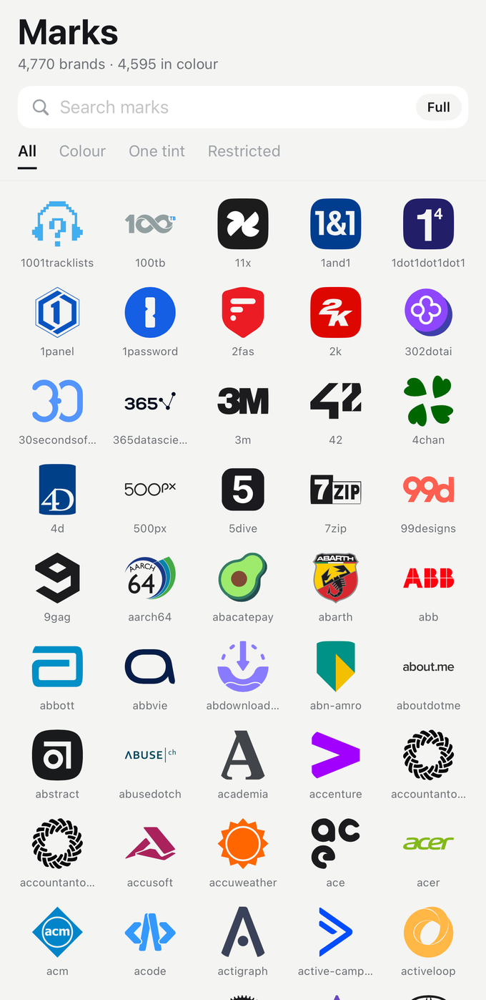
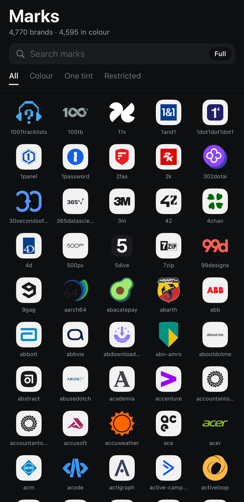
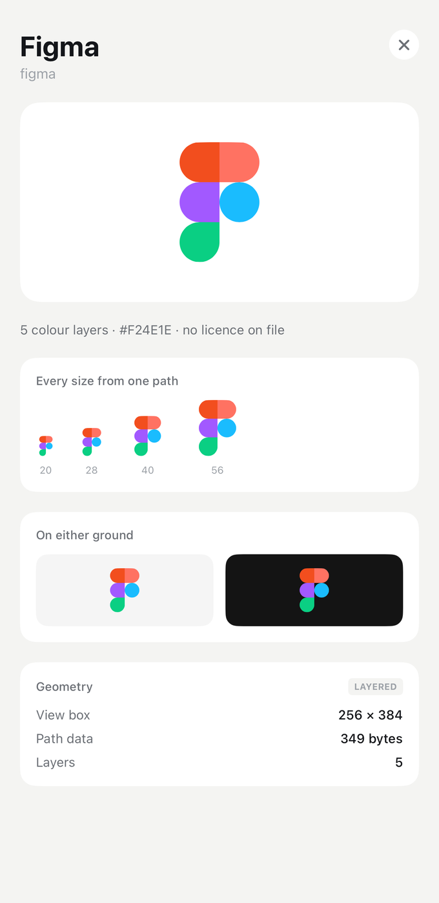

# BrandIcons

[](https://github.com/infiniah/brand-icons-ios/actions/workflows/ci.yml)
[](https://swift.org)
[](https://swift.org)
[](https://swift.org/package-manager/)
[](LICENSE)

A Swift package that resolves a service name to a brand icon. Swift 6, strict concurrency, no dependencies.

<p align="center">
  
  
  
</p>

## Installation

```swift
.package(url: "https://github.com/infiniah/brand-icons-ios", from: "1.0.0")
```

## Usage

```swift
import BrandIcons

let resolver = BrandIconResolver()
let result = await resolver.resolve(BrandQuery(name: "APPLE.COM/BILL SPOTIFY"))

if let icon = result.best(minimum: 0.8) {
    draw(icon)
} else if result.isAmbiguous() {
    askTheUser(result.candidates)
}
```

`BrandIconResolver` is an actor and caches per query, so calling it once per row of a list is fine.
It loads the catalogue itself; there is nothing to locate or parse.

To draw a candidate:

```swift
BrandIconView(candidate: icon, fallbackText: "Spotify", size: 40)
```

A vector mark is filled directly, raster artwork is decoded, and a candidate with nothing to draw
falls back to a monogram so a list never develops holes while lookups are in flight.

## How it works

A lookup runs in four steps. Nothing leaves the device unless you turn a network tier on.

**1. Normalise.** The query is lowercased, stripped of diacritics and punctuation, and split into
words. Words that describe a payment rather than a brand are dropped, so `APPLE.COM/BILL SPOTIFY`
becomes `spotify`. Words that describe a tier are held aside rather than dropped, because they are
what separates two real brands: `Apple Music` and `Apple TV` share a root and are different things.

**2. Narrow.** Two indexes decide what is worth scoring: an exact map from normalised key, and an
inverted index from word to marks. A query whose words appear nowhere falls back to the whole
catalogue, because a misspelling shares no word and edit distance is what should catch it.

**3. Score.** Each shortlisted mark is scored 0 to 1 from signals that can be explained rather than
one fuzzy distance, in descending order of trust: the normalised keys match; every word of one
appears in the other; words overlap partly; the strings are merely close in edit distance. A tier
word present on one side only applies a penalty.

**4. Rank.** Candidates are sorted, deduplicated per brand, and cut at `minimumConfidence`. When a
tier that returns real artwork is enabled and confident, it outranks a flat catalogue mark.

| Score | Meaning |
| --- | --- |
| 1.00 | the normalised names are identical |
| 0.72 – 0.90 | the query is the brand plus extra words |
| 0.42 – 0.60 | the brand is more specific than the query. `Apple` is not `Apple TV` |
| below 0.35 | discarded rather than returned |

The score is meant to be acted on. `best(minimum:)` returns a candidate only above the bar you set,
and `isAmbiguous()` reports when the top two are close enough that picking silently is a guess.

## The icon library

Two catalogues ship. They differ only in which marks they contain; the code, the scoring and the
API are identical.

| | brands | with colour | monochrome | in your bundle |
| --- | --- | --- | --- | --- |
| **full** | 4,770 | 4,595 | 175 | 3.04 MB |
| **compact** | 4,473 | 4,304 | 169 | 1.91 MB |

Sizes are compressed, which is what an app store ships.

The compact catalogue leaves out 297 marks whose path data runs past 4 KB. Those are illustrations
rather than icons, detailed enough to be indistinct at 40 points, and they account for most of the
difference in size.

### Choosing one

```swift
let resolver = BrandIconResolver(variant: .compact)
```

`BundledCatalog.marks(.compact)` reads the same set directly.

### Where the marks come from

| Set | Licence | Contributes |
| --- | --- | --- |
| [Simple Icons](https://github.com/simple-icons/simple-icons) 16.28.0 | CC0-1.0 | the monochrome set, one path and one brand colour per mark |
| [theSVG Color](https://thesvg.org) 1.2.4 | MIT | full colour artwork |
| [SVG Logos](https://github.com/gilbarbara/logos) 1.2.13 | CC0-1.0 | full colour artwork for brands theSVG misses |

Simple Icons is monochrome by construction. That is right for most brands and wrong for one whose
identity *is* colour: Figma flattens to a hollow outline, Duolingo to a green silhouette. It also
omits brands removed on trademark request, Microsoft and Slack among them. The colour sets fill
both gaps.

A mark carries either a single path and a tint, or a list of coloured layers. It never carries
both: the flattened silhouette of a mark that has colour artwork is never drawn, and shipping it
anyway cost 3.3 MB.

223 marks record terms beyond their set's default, some forbidding commercial use or derivative
works. `excludesRestrictiveLicenses` leaves them out. CC0 and MIT waive copyright in the drawing
and neither touches trademark, so read [NOTICE](NOTICE) before shipping a mark.

## Providers

Providers are asked cheapest first, and the resolver stops as soon as a candidate is good enough,
so a name the catalogue knows never opens a socket.

| Tier | Network | Credential | Payload | Confidence it can reach |
| --- | --- | --- | --- | --- |
| Bundled | none | none | vector | up to 1.00 |
| Site icon | manifest, then head, then guessed paths | none | raster | 0.35 to 0.65 |
| Apple App Store | one request, plus one for artwork | none | raster | up to 1.00 |

**Bundled** is the catalogue above.

**Site icon** reads the service's own site: its web manifest first, then the icons declared in its
head, then the well known paths. No third party sits in the middle. It is capped low because a
site answering on a guessed host proves the host exists, not that it belongs to the company meant.

**Apple App Store** searches the iTunes API. Off by default: Apple limits it to roughly twenty
requests a minute, and its terms describe the artwork as promotional material for store content.
It is named for Apple on every platform, because Google publishes no equivalent public search API,
so there is no Play tier.

## Configuration

```swift
var configuration = ResolverConfiguration.default
configuration.allowsAppStore = true               // off by default
configuration.minimumConfidence = 0.4
configuration.excludesRestrictiveLicenses = true

let resolver = BrandIconResolver(configuration: configuration)
```

`.offline` disables every network tier. `.exhaustive` asks all of them and never stops early, which
is what `probe(_:)` uses to compare them.

## API

| Type | Purpose |
| --- | --- |
| `BrandIconResolver` | actor that runs a lookup across the providers |
| `BrandQuery` | a name, optionally a domain and a known slug |
| `BrandIconResult` | ranked candidates, with `best(minimum:)` and `isAmbiguous()` |
| `BrandIconCandidate` | one answer: slug, title, confidence, source, shape |
| `BrandIconShape` | `.vector`, `.layeredVector` or `.raster` |
| `BrandIconView` | SwiftUI view that draws any of them |
| `ResolverConfiguration` | thresholds, which tiers run, source preference |
| `BundledCatalog` | the compiled marks, and licence filtering |
| `SVGPathParser` | path data to `CGPath`, if you want to draw it yourself |

## Documentation

| | |
| --- | --- |
| [Provider tiers](docs/providers.md) | what each source costs and when a bundled mark is the wrong picture |
| [Configuration](docs/configuration.md) | every option |
| [How matching works](docs/matching.md) | the scoring bands and lookup cost |
| [Licensing the marks](docs/licensing.md) | CC0, MIT, trademark, and the restrictive handful |

API reference: `swift package generate-documentation`.

## Example app

Marks is a browser for the whole catalogue: search it, filter it by facet, switch between the two
catalogues, and open any mark to see what the package knows about it. The same app is built four
times, once per platform, so a change that looks right on one can be checked against the others.

Open `Examples/Marks/Marks.xcodeproj` and run.

## Other platforms

The same library, checked against the same generated fixtures so every platform
agrees on what a name means and on what shape gets drawn.

| Platform | Repository |
| --- | --- |
| iOS and macOS, Swift | this repository |
| Android, Kotlin | [infiniah/brand-icons-android](https://github.com/infiniah/brand-icons-android) |
| Flutter, Dart | [infiniah/brand-icons-flutter](https://github.com/infiniah/brand-icons-flutter) |
| React Native and Expo, TypeScript | [infiniah/brand-icons-expo](https://github.com/infiniah/brand-icons-expo) |

## Contributing

Issues and pull requests welcome. Run `swift test` before opening a pull request.

## License

MIT for the code. The marks carry their own terms, see [NOTICE](NOTICE).
